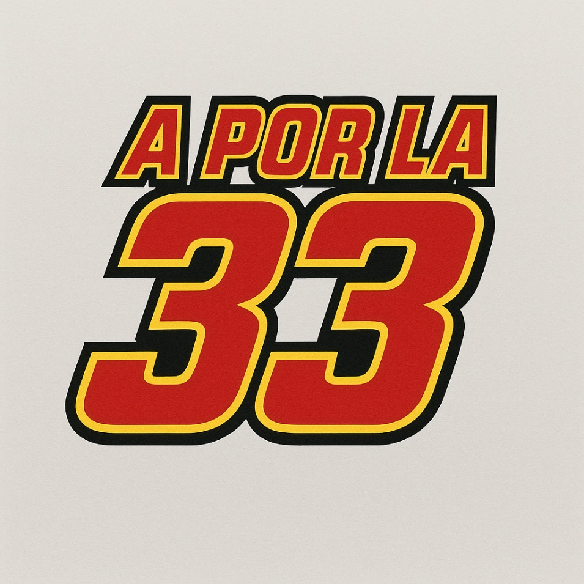

# A POR LA 33

Juego arcade de estilo 8 bits de carreras multijugador donde deberas completar 3 vueltas al circuito antes que tu rival y así ganar la trigésima tercera copa.

## Integrantes del equipo de desarrollo

- Mario Rodrigo Arévalo
    - Correo: m.rodrigo.2023@alumnos.urjc.es
    - Cuenta de GitHub: Frikuz
- Jorge Sánchez de Lemos
    - Correo: j.sanchezde.2020@alumnos.urjc.es
    - Cuenta de GitHub: Blodjor
- Jiajie Liu
    - Correo: jj.liu.2023@alumnos.urjc.es
    - Cuenta de GitHub: killer300012
- David Santos Horcajuelo
    - Correo: d.santosh.2023@alumnos.urjc.es
    - Cuenta de GitHub: zireaeldragmire

    

# GDD

Juegos en red

16 de octubre de 2025

Jorge Sanchez, David Santos, Jiajie Liu, Mario Rodrigo

# Contenido

- Género 

    - Público

- Plataforma

- Mecánicas

    - Controles

- Modo de juego

- Diagrama de flujo

- Música

- Sonido

- Interfaz

- Arte

- Narrativa

- Objetivo del juego

- Marketing

- Logo

- Imágenes de referencia / Inspiración

# Género

Este juego se basa en los simuladores de juegos arcade, proponiendo
partidas frenéticas y rápidas, mezclado con la velocidad que aportan las
carreras de coches.

## Público

Este juego se ha pensado con el fin de llegar a un público fan del
motor.

# Plataforma

El juego está pensado para salir únicamente en pc y como juego flash.

# Mecánicas

Este juego al ser pensado y tratado como un juego arcade las mecánicas
planteadas son las siguientes:

- Cámara: se usará una vista cenital, para que ambos jugadores puedan
  ver todo el circuito al mismo tiempo

- Movimiento: los jugadores se moverán por el circuito siguiendo la
  trazada, tratando de esquivar al jugador rival o darse con los
  diferentes obstáculos.

- Choques: Para aportar algo de dinamismo al juego se implementarán
  choques entre los jugadores y también obstáculos, véase muros o
  barreras.

## Controles 

- Jugador 1: Este jugador conducirá su coche con las teclas “WASD”

  - W: Para acelerar

  - A: Para girar a la izquierda

  - D: Para girar a la derecha

  - S: Para frenar

- Jugador 2: Este jugador conducirá su coche con las teclas “↑←↓→”

  - ↑: Para acelerar

  - ←: Para girar a la izquierda

  - →: Para girar a la derecha

  - ↓: Para frenar

# Modo de juego

Este juego se ha pensado para poder jugarlo de 2 maneras

- Multijugador local

- Multijugador online

# Diagrama de flujo
 

# Música 

La música de este juego tendrá un estilo al himno de la Formula 1 pero
con temática 8Bit para que cuadre con la temática de arcade

# Sonido

Los coches harán sonidos cuando aceleren y cuando tengan algún choque

# Interfaz

La interfaz de este juego es muy sencilla ya que solo contará con un
temporizador para ver qué jugador es el más rápido.

# Arte

El arte pensado para el juego es Retro 8Bit para evocar más aun el
sentimiento de estar jugando en un arcade.

# Narrativa

La historia del juego se basa en como tú te pones en el papel del famoso
piloto de carreras, Leonardo Sonso y tienes que ganar a tu mayor rival,
Carlos Santos, para conseguir tu trigésimo tercera copa.

La historia contará como vas escalando desde lo más bajo porque tu
anterior equipo te ha expulsado y al cambiarte a una nueva carrocería
todo parece ir mucho mejor.

# Objetivo del juego

El objetivo del juego es competir contra un amigo para ver quien se
lleva la copa de campeón y así ver quién es el mejor piloto de carreras.

# Marketing

Si se tuviese un presupuesto muy amplio la idea sería publicitarlo en
los anuncios de la “Formula 1”, pero al ser eso un trabajo muy
complicado la estrategia más razonable sería hacer páginas de Instagram,
TikTok y X, para así llegar a la mayor cantidad de público. Además,
también se va a publicar una demo en plataformas como Newgrounds o
Itch.io para atraer más gente al producto.

Para el futuro intentar conseguir patrocinadores y representarlos tanto
en el diseño de circuito como la publicidad que aparece en los reales o
hacer coches que sean de los propios patrocinadores.

# Logo

El logo del juego se ha buscado que sea lo más sencillo y reconocible,
el logo surge de la mezcla de usar la estética del personaje de Disney,
Rayo McQueen, y el famoso “*meme*” de la Formula 1.

Para los colores se han usado los de la paleta de Rayo McQueen

- Rojo: como color de relleno dominante, que transmite velocidad,
  energía y pasión.

- Amarillo: como borde intermedio, aportando contraste y resaltando el
  texto sobre cualquier fondo.

- Negro: como contorno exterior, que define claramente las formas y da
  sensación de fuerza y tridimensionalidad.

# Imágenes de referencia / Inspiración

- Modelos de referencia de los coches

- Modelo de referencia del circuito

- Inspiración para el logo

- Inspiración para el juego

# FASE 2

Durante la segunda fase, hemos buscado desarollar una versión funcionald el juego basándonos en los conocimientos que poseíamos de Phaser y JavaScript.
Hemos realizado las diversas escenas entre las cuales puede un jugador moverse, siendo estas:

- Menu
- Juego
- Pausa
- Créditos
- Escena de victoria

El jugador se peude desplazar comodamente entre las diversas pantallas del juego y no se queda astacado en ninguna de ellas.

Respecto a la jugabilidad, hemos priorizado el tener un prototipo funcional que refinar en las posteriores fases.

Finalmente, hemos diseño e implementado assets propios, como son los coches, el escenario y el logotipo.

